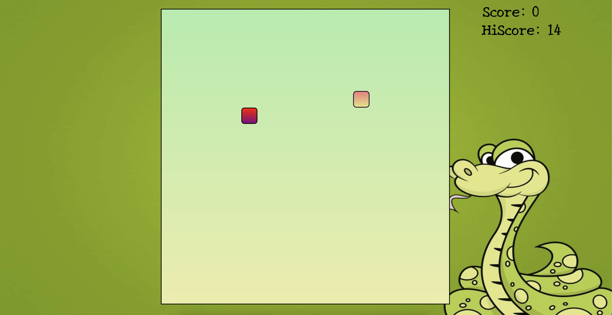

# Snake Game

A classic Snake game implemented using HTML, CSS, and JavaScript.

## Introduction

This project is a simple implementation of the classic Snake game where the player controls a snake that grows in length as it eats food. The objective is to eat as much food as possible without colliding with the snake's own body or the game boundaries.

## Features

- Snake movement controlled by arrow keys
- Food generation and scoring system
- Game over when the snake collides with itself or the boundaries
- Optional feature: Snake wraps around the screen borders instead of ending the game

## Demo

[Link to Live Demo](https://snake-game-weld-two.vercel.app/) 

 

## Setup

1. Clone the repository:

   ```bash
   git clone https://github.com/Ritulkr/Snake-Game.git
   ```

2. Open `index.html` in your web browser.

## Usage

- Use the arrow keys to control the direction of the snake.
- Eat the food (green dots) to grow the snake and increase your score.
- Avoid colliding with the snake's own body or the game boundaries.

## Customization

You can customize the game by modifying the following files:

- `index.html`: Structure of the game and layout.
- `style.css`: Styling of the game elements.
- `script.js`: JavaScript logic for game mechanics.

## Credits

- Developed by [Ritul Kumar](https://github.com/Ritulkr)

## License

This project is licensed under the [MIT License](LICENSE).

---
